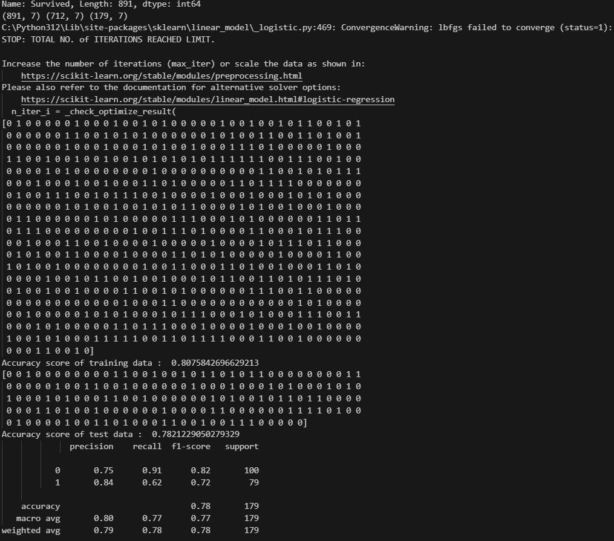
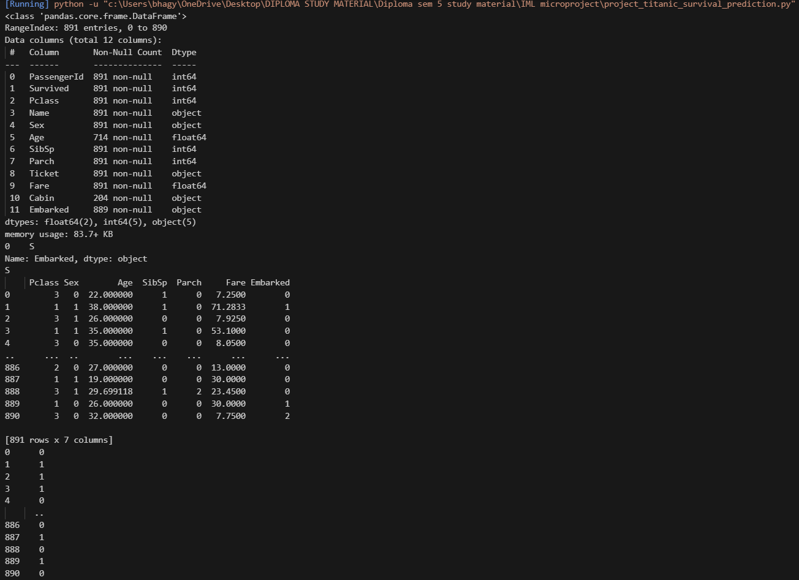
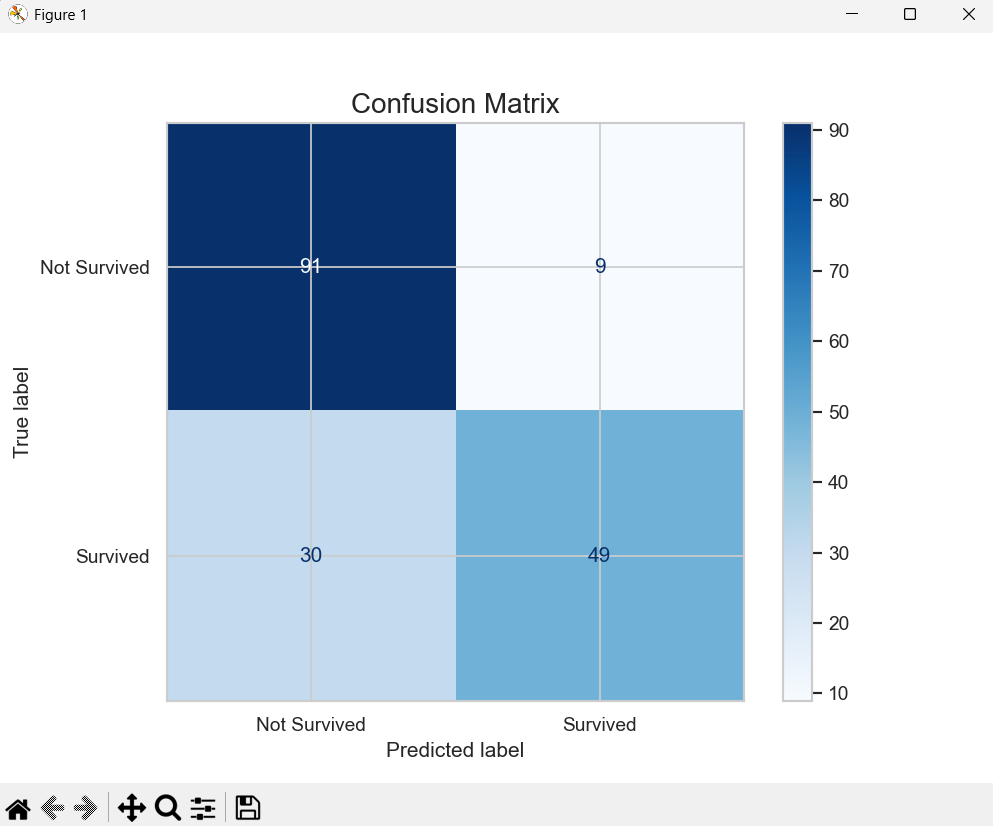
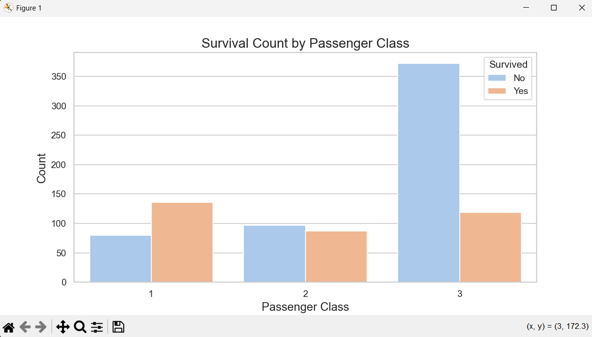
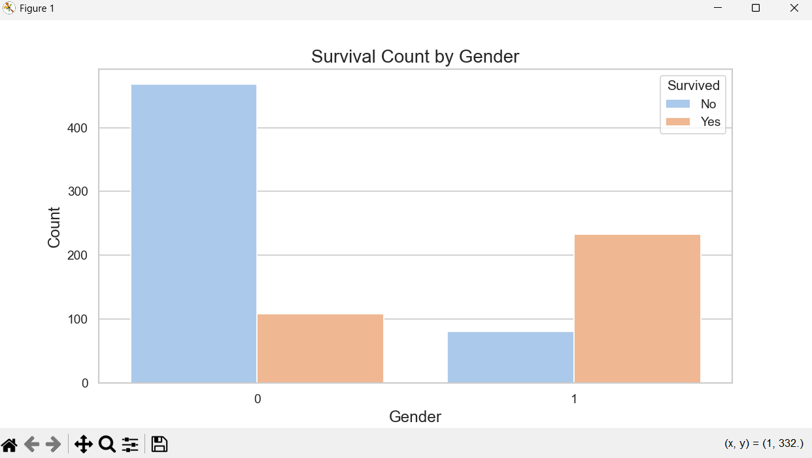
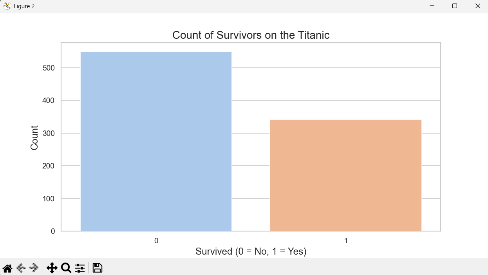

# Titanic Survival Predictor 🚢


Machine Learning project using Logistic Regression to predict whether a passenger survived the Titanic disaster.

---

## 📌 Features

- Data preprocessing
- Missing value handling
- Data visualization
- Logistic Regression model
- Accuracy evaluation
- Confusion matrix generation

---

## 🛠 Technologies Used

- Python
- NumPy
- Pandas
- Matplotlib
- Seaborn
- Scikit-learn

---

## 📂 Project Structure

```bash
Titanic-Survival-Predictor/
│
├── titanic_prediction.py
├── train.csv
├── requirements.txt
├── README.md
└── screenshots/
```

---

## ▶️ How to Run

### 1️⃣ Install Required Libraries

```bash
pip install -r requirements.txt
```

### 2️⃣ Run the Project

```bash
python titanic_prediction.py
```

---

## 🤖 Machine Learning Model

- Logistic Regression

---

## 📊 Model Accuracy

- Training Accuracy: **80.75%**
- Testing Accuracy: **78.21%**

---

## 📸 Screenshots

---

### 📌 Dataset Information



---

### 📌 Model Accuracy & Classification Report



---

### 📌 Confusion Matrix



---

### 📌 Survival Count



---

### 📌 Survival Count by Gender



---

### 📌 Survival Count by Passenger Class



---

## 📈 Conclusion

The Logistic Regression model successfully predicts Titanic passenger survival with good accuracy using features like:

- Gender
- Age
- Passenger Class
- Fare
- Embarked Port

The project also visualizes important survival patterns through graphs and confusion matrix analysis.

---

## 👨‍💻 Author

BSB
